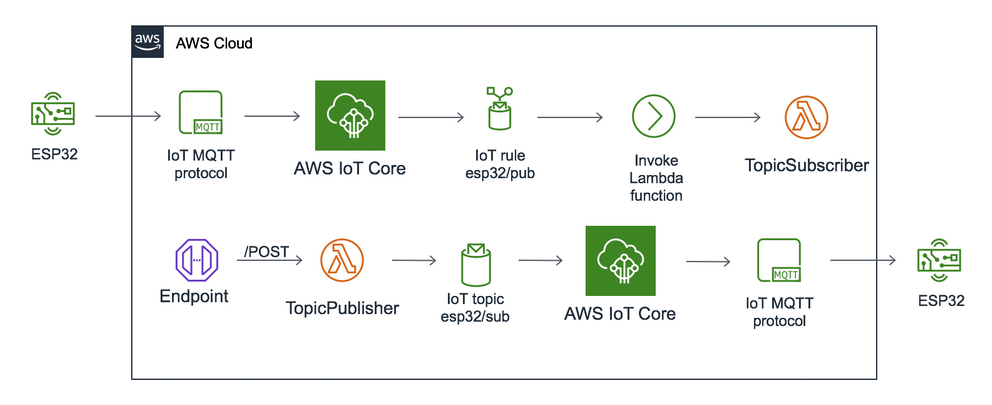

# Valutazione servizi di hosting

- [Valutazione servizi di hosting](#valutazione-servizi-di-hosting)
  * [Tipi di soluzioni](#tipi-di-soluzioni)
  * [Prezzi VPS](#prezzi-vps)
    + [Linode](#linode)
    + [Digital Ocean](#digital-ocean)
    + [Aruba](#aruba)
  * [Prezzi servizi AWS](#prezzi-servizi-aws)
  * [Stima dei tempi](#stima-dei-tempi)
  * [Conclusioni](#conclusioni)

## Tipi di soluzioni

- `VPS` (macchina virtuale)
  - **PRO**:
    - massima personalizzazione dei servizi installati (applicazioni, container)
    - indipendenza da un particolare fornitore
    - maggiore facilità di backup e ripristino
    - prezzi chiari fin dall'inizio
  - **CON**:
    - configurazione manuale dei servizi
    - ridondanza dei servizi inferiore (single point of failure)
    - connettività dipendente dalla locazione geografica del server
    - prestazioni non costanti (caso CPU condivisa)
- `Servizi AWS`
  - **PRO**:
    - nessuna (o quasi) configurazione manuale
    - ridondanza e disponibilità di risorse garantite (soluzione cloud)
    - indipendenza dalla locazione geografica (CDN con vari nodi sparsi per il globo)
  - **CON**:
    - complicati da inquadrare all'inizio (maggiore incertezza)
    - rivolti più ad un pubblico enterprise
    - prezzi variabili in base all'utilizzo (difficile fare una stima precisa)

## Prezzi VPS

### Linode

- CPU condivisa
  - piani più economici
  - prestazioni influenzate dalle altre macchine virtuali che ci girano (non dovrebbe essere un grosso problema per questo tipo di applicazione)
  - backup: 2\$ - 5\$ / mese

- CPU dedicata
  - piani più costosi
  - prestazioni superiori, potenza di calcolo dei core dedicata
  - backup: 5\$ - 10\$ / mese

- Database (MySQL, PostgreSQL)
  - separazione dei dati dal server su cui gira l'applicazione
  - backup giornalieri inclusi
  - accesso sicuro con filtraggio degli IP
  - scelta dello spazio disco in base alla quantità di informazioni da salvare (1 nodo con 1/2 GB dovrebbe bastare)

- Vantaggi di Linode:
  - molte funzionalità incluse gratuitamente
    - protezione DDoS
    - cloud firewall
    - gestione DNS
    - monitoraggio e alerts
  - assistenza clienti gratuita 24/7/365
  - sito web e documentazione facili ed intuitivi da comprendere
- Svantaggi:
  - il nodo main più vicino si trova a Francoforte
- **Costo medio**: 55€ / mese (Linode 4GB, 2GB DataBase, Backup)

### Digital Ocean

- CPU condivisa
  - backup: 5% del costo della VM (4 backup al mese)

- CPU dedicata
  - backup: 5% del costo della VM (4 backup al mese)

- Database (MySQL, PostgreSQL)

- Svantaggi:
  - il nodo main più vicino si trova a Francoforte
  - leggermente più costoso
  - distinzione tra supporto gratuito (risposta in < 24h) e a pagamento (< 2h, \$100/mese)
- **Costo medio**: 55€ / mese (VM 4GB, 2GB DataBase, Backup)

### Aruba

- CPU condivisa
  - piani più economici
  - prestazioni influenzate dalle altre macchine virtuali che ci girano (non dovrebbe essere un grosso problema per questo tipo di applicazione)
  - backup: 1,5 €/mese + IVA ogni 10 GB

- CPU dedicata
  - backup: 1,5 €/mese + IVA ogni 10 GB

- Database (MySQL, PostgreSQL)

- Vantaggi Aruba:
  - datacenter in Italia (connettività 1 Gb/s)
  - assistenza clienti 24/7/365
  - sembra più economico delle altre soluzioni
- Svantaggi:
  - sito web meno intuitivo degli altri
- **Costo medio**: 20€ / mese (VM 4GB, 2GB DataBase, Backup)

## Prezzi servizi AWS

Considerando la seguente architettura:

- **AWS IoT Core**

  - fino ad 1 miliardo di messaggi: \$1.20 (MQTT / HTTP)
  - messaggi fino a 128 KB

  

- **Amazon S3** (Storage per pagine web parte frontend)
  
  - \$0.024 per GB
- **CloudFront** (CDN per distribuire le pagine web del frontend)
  - 1 GB di trasferimento dati in uscita, 10.000.000 richieste HTTP e HTTPS, più 2.000.000 di chiamate a CloudFront Function ogni mese gratuitamente
  -  primi 10 TB \$0.085 

- **Funzioni Lambda** (Backend)
  - \$0.20 per milione di richieste (ogni mese 1 milione gratuito)
  - si paga anche per il tempo di esecuzione
- **RDS** (Relational Database Service)
  - 750 hours di utilizzo, 20GB di SSD, 20GB per il backup gratuitamente ogni mese
  - \$0.2 - \$0.5 / ora
- **API Gateway**
  - \$3.50 / milione di richieste HTTP

## Stima dei tempi

- soluzione VPS: `3.5 - 4 mesi`
- soluzione AWS: `5 - 5.5 mesi`

## Conclusioni

Sebbene il costo dei servizi AWS potrebbe essere inferiore rispetto ad affittare una macchina virtuale, il tempo speso per capire la documentazione e come integrare tra loro questi servizi sembra esagerato per il tipo di applicazione richiesta.